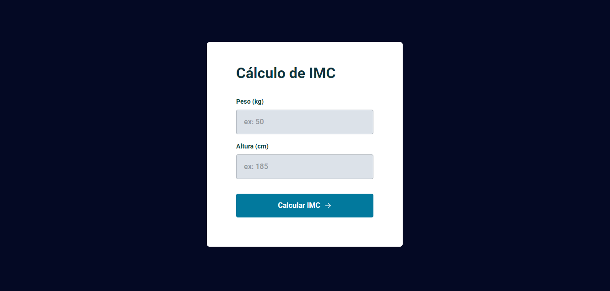
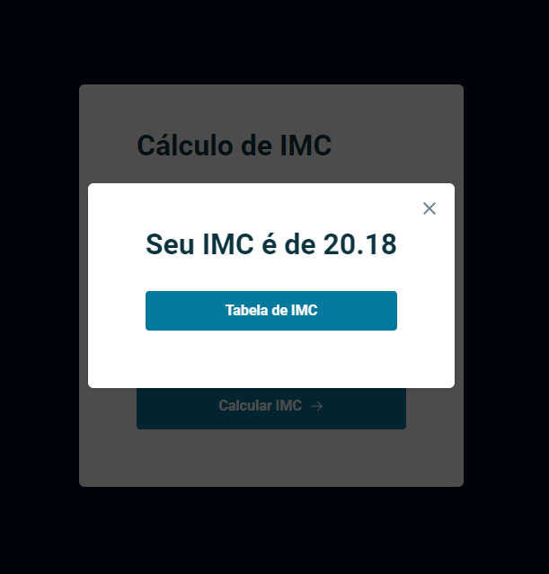
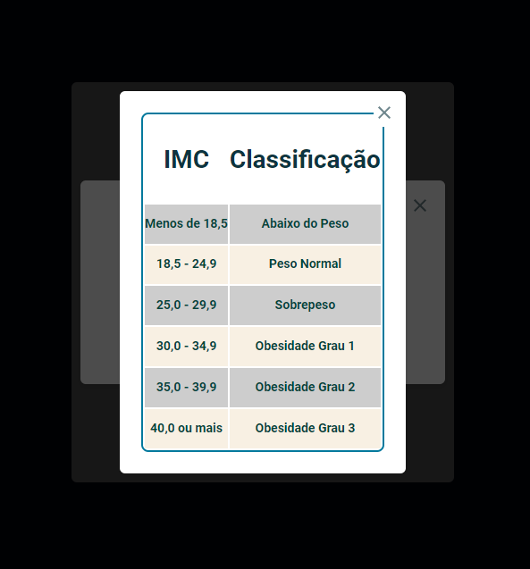

<h1 align="center"> IMC </h1>

Cuidar da saúde é sempre o melhor a se fazer não é mesmo? Fique por dentro do seu  Índice de massa corporal.

  <a href="#-tecnologias">Tecnologias</a>&nbsp;&nbsp;&nbsp;|&nbsp;&nbsp;&nbsp;
  <a href="#-projeto">Projeto</a>&nbsp;&nbsp;&nbsp;

## 💻 Projeto

  

  
  

  

## 🚀 Tecnologias

Esse projeto foi desenvolvido com as seguintes tecnologias:

- HTML e CSS
- JavaScript

## 🔖 Layout

Você pode visualizar o resultado clincando neste [LINK](https://kiqprado.github.io/IMC/).

---

 
  
  &nbsp;&nbsp;&nbsp;|&nbsp;&nbsp;&nbsp;
  
 

